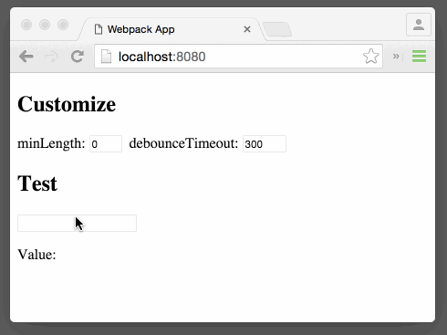

# react-debounce-input


[](https://gitter.im/nkbt/help)

[](https://circleci.com/gh/nkbt/react-debounce-input)
[](https://coveralls.io/r/nkbt/react-debounce-input?branch=master)
[](https://david-dm.org/nkbt/react-debounce-input)
[](https://david-dm.org/nkbt/react-debounce-input#info=devDependencies)

React component that renders Input with debounced onChange
Can be used as drop-in replacement for `<input type="text" />`





## Installation

### NPM

```sh
npm install --save react-debounce-input
```


### Bower:
```sh
bower install --save https://npmcdn.com/react-debounce-input/build/react-debounce-input.js
```

or in `bower.json`

```json
{
  "dependencies": {
    "react-debounce-input": "https://npmcdn.com/react-debounce-input/build/react-debounce-input.js"
  }
}
```

then include as
```html
<script src="bower_components/react-debounce-input/index.js"></script>
```


### 1998 Script Tag:
```html
<script src="https://npmcdn.com/react-debounce-input/build/react-debounce-input.js"></script>
(Module exposed as `DebounceInput`)
```


## Demo

[http://nkbt.github.io/react-debounce-input/example](http://nkbt.github.io/react-debounce-input/example)

## Codepen demo

[http://codepen.io/nkbt/pen/VvmzLQ](http://codepen.io/nkbt/pen/VvmzLQ?editors=101)

## Usage

```js
import React from 'react';
import ReactDOM from 'react-dom';
import DebounceInput from 'react-debounce-input';

const App = React.createClass({
  getInitialState() {
    return {
      value: ''
    };
  },

  render() {
    return (
      <div>
        <DebounceInput
          minLength={2}
          debounceTimeout={300}
          onChange={event => this.setState({value: event.target.value})} />

        <p>Value: {this.state.value}</p>
      </div>
    );
  }
});

const appRoot = document.createElement('div');
document.body.appendChild(appRoot);
ReactDOM.render(<App />, appRoot);
```

## Options


#### `onChange`: PropTypes.func.isRequired

Function called when value is changed (debounced) with original event passed through


#### `value`: PropTypes.string

Value of the Input box. Can be omitted, so component works as usual non-controlled input.


#### `minLength`: PropTypes.number (default: 2)

Minimal length of text to start notify, if value becomes shorter then `minLength` (after removing some characters), there will be a notification with empty value `''`.


#### `debounceTimeout`: PropTypes.number (default: 100)

Notification debounce timeout in ms. If set to `-1`, disables automatic notification completely. Notification will only happen by pressing `Enter` then.


#### `forceNotifyByEnter`: PropTypes.bool (default: true)

Notification of current value will be sent immediately by hitting `Enter` key. Enabled by-default. Notification value follows the same rule as with debounced notification, so if Length is less, then `minLength` - empty value `''` will be sent back.

*NOTE* if `onKeyDown` callback prop was present, it will be still invoked transparently.


#### Arbitrary props will be transferred to rendered `<input>`

```js
<DebounceInput
  onChange={event => this.setState({value: event.target.value})}
  placeholder="Name"
  className="user-name" />
```

Will result in

```js
<input type="text"
  placeholder="Name"
  className="user-name" />
```

## Development and testing

To run example covering all `DebounceInput` features, use `npm start`, which will compile `src/example/Example.js`

```bash
git clone git@github.com:nkbt/react-debounce-input.git
cd react-debounce-input
npm install
npm start

# then
open http://localhost:8080
```

## Tests

```bash
npm test

# to run tests in watch mode for development
npm run test:dev

# to generate test coverage (./reports/coverage)
npm run test:cov
```

## License

MIT
